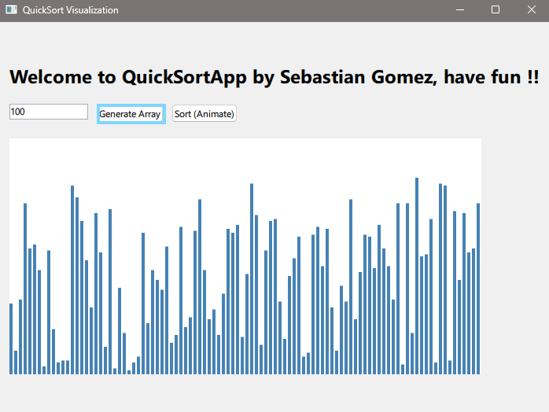
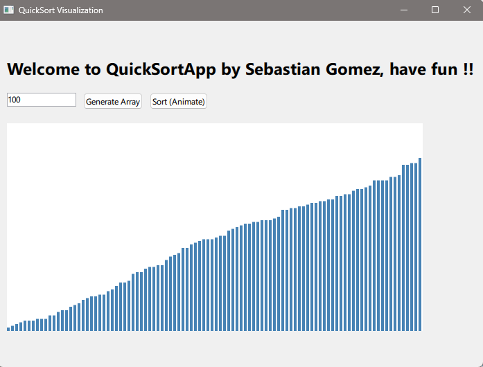

# quickSort
Contains a QT project for a Windows standalone app for visualization of the Quick Sort Algorithm 

## Execute standalone version on Windows

- Download the repository 
- Extract all files
- Open the directory `..\quickSortAlgorithm\build\Desktop_Qt_6_10_1_MinGW_64_bit-MinSizeRel`
- Execute `appquickSortAlgorithm.exe`

## GUI Guide

### Generate random array

Given the desired length of the array click on Generate to create a random array, the values are visualized in the below plot.

### Quick Sorting

The random array is then sorted, an animation for the algorithm is shown. For the sake of animation, the sort algorithm has a delay between steps.

